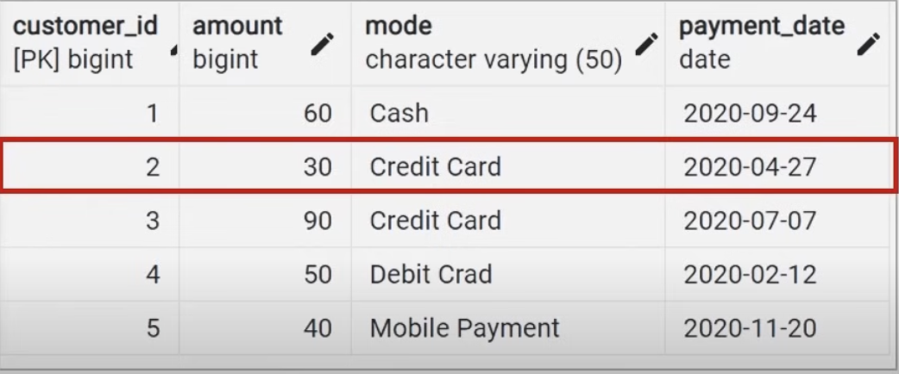
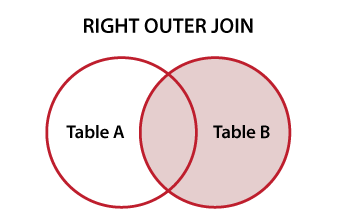

# SQL

## How we connect with mysql server.
### Step 1
```bash
mysql.server start
```
- **Note:** For connect and start the mysql server.

---

### Step 2
```bash
mycli -u root -p mysql
```
- **Note:** These is for autocompletion of queries.

---

### Step 3
```bash
\q
```
- **Note:** Exit from mysql Cell.

---


### Step 4
```bash
mysql.server stop 
```
- **Note:** For stopping server jo ki bg me ru ho rha hai.

---

## command

### 1. Database Creation:
```bash
CREATE DATABASE <database_name>;
```
- **✅ Output in cell:** 
```
Query OK, 1 row affected
```
---

### 2. Using the Database:
```bash
USE <database_name>;
```
- **✅ Output in cell:** 
```
You are now connected to database "newDB" as user "root"
```
---

### 3. Creating a Table (Main):
```bash
CREATE TABLE <table_name> (id BIGINT PRIMARY KEY, name varchar(50), grades char(20), city varchar(30) );
```
- **✅ Output in cell:** 
```
Query OK, 0 rows affected
```
---


### 4. Viewing the Table and Accessing All Records (Main):
```bash
SELECT * FROM <table_name>;
```
- **✅ Output in cell:** 
```
+----+------+--------+------+
| id | name | grades | city |
+----+------+--------+------+
+----+------+--------+------+
```
---


### 4. Inserting Data into the Table (Main):
```bash
INSERT INTO <table_name> (id, name, grades, city) 
VALUES 
    (value1_id, 'value1_name', 'value1_grade', 'value1_city'),
    (value2_id, 'value2_name', 'value2_grade', 'value2_city'),
    (value3_id, 'value3_name', 'value3_grade', 'value3_city'),
    ...;
```
- **✅ Output in cell:** 
```
Query OK, 10 rows affected
```
- **✅ After - Output in cell:** 
```bash
SELECT * FROM <table_name>;
```
```
+----+---------------+--------+---------------+
| id | name          | grades | city          |
+----+---------------+--------+---------------+
| 1  | Alice Johnson | A      | New York      |
| 2  | Bob Smith     | B      | Los Angeles   |
| 3  | Charlie Brown | A      | Chicago       |
| 4  | Diana Prince  | C      | Houston       |
| 5  | Ethan Hunt    | B      | Miami         |
| 6  | Fiona Davis   | A      | Boston        |
| 7  | George Miller | C      | San Francisco |
| 8  | Hannah Lee    | B      | Seattle       |
| 9  | Ian Clark     | A      | Denver        |
| 10 | Julia Adams   | B      | Dallas        |
+----+---------------+--------+---------------+
```
---


### 5. Update Values in Table (Main):
```bash
UPDATE <table_name> SET name='XYZ' , grades='O' WHERE id=1;
```
- **✅ Output in cell:** 
```
Query OK, 1 row affected
```
- **✅ After - Output in cell:** 
```bash
SELECT * FROM <table_name>;
```
```
+----+---------------+--------+---------------+
| id | name          | grades | city          |
+----+---------------+--------+---------------+
| 1  | XYZ (changes) | O      | New York      |
| 2  | Bob Smith     | B      | Los Angeles   |
| 3  | Charlie Brown | A      | Chicago       |
| 4  | Diana Prince  | C      | Houston       |
| 5  | Ethan Hunt    | B      | Miami         |
| 6  | Fiona Davis   | A      | Boston        |
| 7  | George Miller | C      | San Francisco |
| 8  | Hannah Lee    | B      | Seattle       |
| 9  | Ian Clark     | A      | Denver        |
| 10 | Julia Adams   | B      | Dallas        |
+----+---------------+--------+---------------+
```
---


### 6. Delete Values in Table (Main):
```bash
DELETE FROM <table_name> WHERE <condition_(id=1)>;
```
- **✅ Output in cell:** 
```
You're about to run a destructive command.
Do you want to proceed? (y/n): Y
Your call!
Query OK, 1 row affected
```
- **✅ After - Output in cell:** 
```bash
SELECT * FROM <table_name>;
```
```
+----+---------------+--------+---------------+
| id | name          | grades | city          |
+----+---------------+--------+---------------+
| 1  | XYZ           | O      | New York      |
| 2  | Bob Smith     | B      | Los Angeles   |
| 3  | Charlie Brown | A      | Chicago       |
| 4  | Diana Prince  | C      | Houston       |
| 5  | Ethan Hunt    | B      | Miami         |
| 7  | George Miller | C      | San Francisco |
| 8  | Hannah Lee    | B      | Seattle       |
| 9  | Ian Clark     | A      | Denver        |
| 10 | Julia Adams   | B      | Dallas        |
+----+---------------+--------+---------------+
```
---


### 6. ALTER Table (Main):
- **These command is used for add, delete and modify columns in an existing table.**
- **1. ALTER TABLE - Add column syntax**
```bash
ALTER TABLE <table_name> ADD COLUMN <column_name_with_type_like_int>;
```
- **✅ Output in cell:** 
```
You're about to run a destructive command.
Do you want to proceed? (y/n): Y
Your call!
Query OK, 1 row affected
```
- **✅ After ALTER - Output in cell:** 
```bash
SELECT * FROM <table_name>;
```
```
+----+---------------+--------+---------------+------------+
| id | name          | grades | city          | nativeLang |
+----+---------------+--------+---------------+------------+
| 1  | XYZ           | O      | New York      | <null>     |
| 2  | Bob Smith     | B      | Los Angeles   | <null>     |
| 3  | Charlie Brown | A      | Chicago       | <null>     |
| 4  | Diana Prince  | C      | Houston       | <null>     |
| 5  | Ethan Hunt    | B      | Miami         | <null>     |
| 7  | George Miller | C      | San Francisco | <null>     |
| 8  | Hannah Lee    | B      | Seattle       | <null>     |
| 9  | Ian Clark     | A      | Denver        | <null>     |
| 10 | Julia Adams   | B      | Dallas        | <null>     |
+----+---------------+--------+---------------+------------+
```
---

- **2. ALTER TABLE - Drop column syntax**
```bash
ALTER TABLE <table_name> DROP COLUMN <column_name>;
```
- **✅ Output in cell:** 
```
You're about to run a destructive command.
Do you want to proceed? (y/n): Y
Your call!
Query OK, 1 row affected
```
- **✅ After DROP - Output in cell:** 
```bash
SELECT * FROM <table_name>;
```
```
+----+---------------+--------+------------+
| id | name          | grades | nativeLang |
+----+---------------+--------+------------+
| 1  | XYZ           | O      | <null>     |
| 2  | Bob Smith     | B      | <null>     |
| 3  | Charlie Brown | A      | <null>     |
| 4  | Diana Prince  | C      | <null>     |
| 5  | Ethan Hunt    | B      | <null>     |
| 7  | George Miller | C      | <null>     |
| 8  | Hannah Lee    | B      | <null>     |
| 9  | Ian Clark     | A      | <null>     |
| 10 | Julia Adams   | B      | <null>     |
+----+---------------+--------+------------+
```
---

- **3. ALTER TABLE - Modify/Alter column syntax**
```bash
ALTER TABLE <table_name> MODIFY <column_name_with_type_like_int>;
ALTER TABLE students MODIFY grades VARCHAR(20);
```
- **✅ Output in cell:** 
```
You're about to run a destructive command.
Do you want to proceed? (y/n): Y
Your call!
Query OK, 1 row affected
```

---


### 7. TRUNCATE Table (Main): 
- **The TRUNCATE command in SQL is a Data Definition Language (DDL) statement used to remove all rows from a table instantly, while keeping the table structure, columns, and schema intact.**
```bash
TRUNCATE TABLE <table_name>;
```
- **✅ Output in cell:** 
```
You're about to run a destructive command.
Do you want to proceed? (y/n): y
Your call!
Query OK, 0 rows affected
```
- **✅ After - Output in cell:** 
```bash
SELECT * FROM <table_name>;
```
```
+----+-------+------+-------+------+
| id | color | name | model | type |
+----+-------+------+-------+------+
+----+-------+------+-------+------+
```
---


### 8. DROP Table (Main):
- **This command permanently removes a table and all of its data from the database.**
```bash
DROP TABLE <table_name>;
```
- **✅ Output in cell:** 
```
You're about to run a destructive command.
Do you want to proceed? (y/n): y
Your call!
Query OK, 0 rows affected
```
- **✅ After - Output in cell:** 
```bash
SELECT * FROM <table_name>;
```
```
(1146, "Table 'newdb.cars' doesn't exist")
```
---


### 9. SELECT statement (Main):
- **1. The SELECT statement is used to select data from the table.**
```bash
SELECT <col_names,col2_name,...> FROM <table_name>;
SELECT grades,name FROM students;
```
- **✅ Output in cell:** 
```
+--------+---------------+
| grades | name          |
+--------+---------------+
| O      | XYZ           |
| B      | Bob Smith     |
| A      | Charlie Brown |
| C      | Diana Prince  |
| B      | Ethan Hunt    |
| C      | George Miller |
| B      | Hannah Lee    |
| A      | Ian Clark     |
| B      | Julia Adams   |
+--------+---------------+
```


- **2. The SELECT statement is used to retrieve all the fields (columns) and their data (rows) from a table. In other words, it allows you to access and fetch data stored in the table.**
```bash
SELECT * FROM <table_name>;
```
- **✅ Output in cell:** 
```
+----+---------------+--------+------------+
| id | name          | grades | nativeLang |
+----+---------------+--------+------------+
| 1  | XYZ           | O      | <null>     |
| 2  | Bob Smith     | B      | <null>     |
| 3  | Charlie Brown | A      | <null>     |
| 4  | Diana Prince  | C      | <null>     |
| 5  | Ethan Hunt    | B      | <null>     |
| 7  | George Miller | C      | <null>     |
| 8  | Hannah Lee    | B      | <null>     |
| 9  | Ian Clark     | A      | <null>     |
| 10 | Julia Adams   | B      | <null>     |
+----+---------------+--------+------------+

```


- **3. To SELECT distinct/unique fields available in the table.**
```bash
SELECT DISTINCT <col_names,col2_name,...> FROM <table_name>;
```
- **✅ Output in cell:** 
```
+--------+
| grades |
+--------+
| O      |
| B      |
| A      |
| C      |
+--------+

```

---


### 10. WHERE Clause (Main):
- **The WHERE Clause is used to filter records. It is used to extract only those records that fulfill a specified conditions.**
```bash
SELECT * FROM table_name WHERE condtion;
```
- **✅ Output in cell:** 
```
+----+---------------+--------+------------+
| id | name          | grades | nativeLang |
+----+---------------+--------+------------+
| 3  | Charlie Brown | A      | <null>     |
| 9  | Ian Clark     | A      | <null>     |
+----+---------------+--------+------------+
```
```bash
SELECT <col_names,col2_name,...> FROM table_name WHERE condtion;
```
- **✅ Output in cell:** 
```
+----+---------------+
| id | name          |
+----+---------------+
| 3  | Charlie Brown |
| 9  | Ian Clark     |
+----+---------------+
```


---

### 10.A Operator in SQL
- **The SQL reserved words and characters are called operators, which are used with a WHERE cluase in a SQL query.**
#### Most used Operater:
- **Arithmetic operators:** +, -, *, /, % ``numerical value``
- **Comparison operators:** =, !=, >, <, >=, <= ``Compare two different tables data``
- **Logical operators:** ALL, IN, BETWEEN, LIKE, AND, OR, NOT, ANY ``Perform Boolen values``
- **Bitwise operators:** AND(&) , OR(|) ``perform the bit operations``

```bash
UPDATE students SET nativeLang='English' WHERE grades='C' || grades='O';
```
- **✅ Output in cell:** 
```
+----+---------------+--------+------------+
| id | name          | grades | nativeLang |
+----+---------------+--------+------------+
| 1  | XYZ           | O      | English    |
| 2  | Bob Smith     | B      | Hindi      |
| 3  | Charlie Brown | A      | Hindi      |
| 4  | Diana Prince  | C      | English    |
| 5  | Ethan Hunt    | B      | Hindi      |
| 7  | George Miller | C      | English    |
| 8  | Hannah Lee    | B      | Hindi      |
| 9  | Ian Clark     | A      | Hindi      |
| 10 | Julia Adams   | B      | Hindi      |
+----+---------------+--------+------------+
```
---

```bash
SELECT name FROM students WHERE id>4 && nativeLang='Hindi';
```
- **✅ Output in cell:** 
```
+-------------+
| name        |
+-------------+
| Ethan Hunt  |
| Hannah Lee  |
| Ian Clark   |
| Julia Adams |
+-------------+
```
---

```bash
SELECT * FROM students WHERE id>4 && nativeLang='Hindi';
```
- **✅ Output in cell:** 
```
+----+-------------+--------+------------+
| id | name        | grades | nativeLang |
+----+-------------+--------+------------+
| 5  | Ethan Hunt  | B      | Hindi      |
| 8  | Hannah Lee  | B      | Hindi      |
| 9  | Ian Clark   | A      | Hindi      |
| 10 | Julia Adams | B      | Hindi      |
+----+-------------+--------+------------+
```

---

### 10.B LIMIT Clause
- **The LIMIT clause is used to set an upper limit on the number of tuples return by SQL.**
```bash
SELECT <col_names,col2_name,...,*> FROM <table_name> LIMIT <NUMBER>;
```
- **✅ Output in cell:** 
```
LIMIT 5
+----+---------------+--------+------------+
| id | name          | grades | nativeLang |
+----+---------------+--------+------------+
| 2  | Bob Smith     | B      | Hindi      |
| 3  | Charlie Brown | A      | Hindi      |
| 4  | Diana Prince  | C      | English    |
| 5  | Ethan Hunt    | B      | Hindi      |
| 7  | George Miller | C      | English    |
+----+---------------+--------+------------+
```

---

### 10.C ORDER BY Clause
- **The ORDER BY is used to sort the result-set in ascending (ASC) or descending order (DESC).**
```bash
SELECT <col_names,col2_name,...,*> FROM <table_name> ORDER BY <single_col_name> ASC/DESC;
```
- **✅ Output in cell:** 
```
DESC
+----+---------------+--------+------------+
| id | name          | grades | nativeLang |
+----+---------------+--------+------------+
| 1  | XYZ           | O      | English    |
| 10 | Julia Adams   | B      | Hindi      |
| 9  | Ian Clark     | A      | Hindi      |
| 8  | Hannah Lee    | B      | Hindi      |
| 7  | George Miller | C      | English    |
| 5  | Ethan Hunt    | B      | Hindi      |
| 4  | Diana Prince  | C      | English    |
| 3  | Charlie Brown | A      | Hindi      |
| 2  | Bob Smith     | B      | Hindi      |
+----+---------------+--------+------------+

ASC
+----+---------------+--------+------------+
| id | name          | grades | nativeLang |
+----+---------------+--------+------------+
| 2  | Bob Smith     | B      | Hindi      |
| 3  | Charlie Brown | A      | Hindi      |
| 4  | Diana Prince  | C      | English    |
| 5  | Ethan Hunt    | B      | Hindi      |
| 7  | George Miller | C      | English    |
| 8  | Hannah Lee    | B      | Hindi      |
| 9  | Ian Clark     | A      | Hindi      |
| 10 | Julia Adams   | B      | Hindi      |
| 1  | XYZ           | O      | English    |
+----+---------------+--------+------------+

```

---

### 11. Import CSV file in SQL (Main):
- PENDING

---

### 12. String Functions (Main):
- **Function in SQL are the database objects thst contain a set of SQL statements to perform a specific task. A function accepts input parameters, perform actions, and then return the result.**

#### Tpyes of functions:
- **System Defined function:** Example: ``rand(), round(), upper(), lower(), count(), sum(), max(), etc.``
- **User Defined function:** Once you defined a fuction can call it in the same way as the built in funtions.

- ``**Functions**``
    * **UPPER():** converts the values of a field to uppercase.
    * **LOWER():** converts the values of a field to lowercase.
    * **LENGTH():** return the length of text field value.
    * **SUBSTRING():**
    * **NOW():** return the current system data and time.
    * **FORMAT():** used ti set the format of a field.
    * **CONCAT():**
    * **REPLACE():** replaces all occurrences of a substring with in string, with new substring.
    * **TRIM():** removing leading and tralling spaces.


---

- **✅ Outputs in cell:**
```
UPPER()
```
```bash
SELECT UPPER(name),id,grades,nativeLang FROM students;
```
```
+---------------+----+--------+------------+
| UPPER(name)   | id | grades | nativeLang |
+---------------+----+--------+------------+
| XYZ           | 1  | O      | English    |
| BOB SMITH     | 2  | B      | Hindi      |
| CHARLIE BROWN | 3  | A      | Hindi      |
| DIANA PRINCE  | 4  | C      | English    |
| ETHAN HUNT    | 5  | B      | Hindi      |
| GEORGE MILLER | 7  | C      | English    |
| HANNAH LEE    | 8  | B      | Hindi      |
| IAN CLARK     | 9  | A      | Hindi      |
| JULIA ADAMS   | 10 | B      | Hindi      |
+---------------+----+--------+------------+
```

---

```
LOWER(field)
```
```bash
SELECT LOWER(name),id,grades,nativeLang FROM students;
```
```
+---------------+----+--------+------------+
| LOWER(name)   | id | grades | nativeLang |
+---------------+----+--------+------------+
| xyz           | 1  | O      | English    |
| bob smith     | 2  | B      | Hindi      |
| charlie brown | 3  | A      | Hindi      |
| diana prince  | 4  | C      | English    |
| ethan hunt    | 5  | B      | Hindi      |
| george miller | 7  | C      | English    |
| hannah lee    | 8  | B      | Hindi      |
| ian clark     | 9  | A      | Hindi      |
| julia adams   | 10 | B      | Hindi      |
+---------------+----+--------+------------+
```

---
```
LENGTH(field)
```
```bash
SELECT LENGTH(name) ,name,id,grades,nativeLang FROM students;
```
```
+--------------+---------------+----+--------+------------+
| LENGTH(name) | name          | id | grades | nativeLang |
+--------------+---------------+----+--------+------------+
| 3            | XYZ           | 1  | O      | English    |
| 9            | Bob Smith     | 2  | B      | Hindi      |
| 13           | Charlie Brown | 3  | A      | Hindi      |
| 12           | Diana Prince  | 4  | C      | English    |
| 10           | Ethan Hunt    | 5  | B      | Hindi      |
| 13           | George Miller | 7  | C      | English    |
| 10           | Hannah Lee    | 8  | B      | Hindi      |
| 9            | Ian Clark     | 9  | A      | Hindi      |
| 11           | Julia Adams   | 10 | B      | Hindi      |
+--------------+---------------+----+--------+------------+
```

---
```
SUBSTRING(field,startIndx,endIndx)
```
```bash
SELECT SUBSTRING(name,1,3) ,name,id,grades,nativeLang FROM students;
```
```
+---------------------+---------------+----+--------+------------+
| SUBSTRING(name,1,3) | name          | id | grades | nativeLang |
+---------------------+---------------+----+--------+------------+
| XYZ                 | XYZ           | 1  | O      | English    |
| Bob                 | Bob Smith     | 2  | B      | Hindi      |
| Cha                 | Charlie Brown | 3  | A      | Hindi      |
| Dia                 | Diana Prince  | 4  | C      | English    |
| Eth                 | Ethan Hunt    | 5  | B      | Hindi      |
| Geo                 | George Miller | 7  | C      | English    |
| Han                 | Hannah Lee    | 8  | B      | Hindi      |
| Ian                 | Ian Clark     | 9  | A      | Hindi      |
| Jul                 | Julia Adams   | 10 | B      | Hindi      |
+---------------------+---------------+----+--------+------------+
```

---
```
CONCAT(field_2,"+",filed_2,field_3...)
```
```bash
SELECT CONCAT(name,"+",grades) ,name,id,grades,nativeLang FROM students;
```
```
+-------------------------+---------------+----+--------+------------+
| CONCAT(name,"+",grades) | name          | id | grades | nativeLang |
+-------------------------+---------------+----+--------+------------+
| XYZ+O                   | XYZ           | 1  | O      | English    |
| Bob Smith+B             | Bob Smith     | 2  | B      | Hindi      |
| Charlie Brown+A         | Charlie Brown | 3  | A      | Hindi      |
| Diana Prince+C          | Diana Prince  | 4  | C      | English    |
| Ethan Hunt+B            | Ethan Hunt    | 5  | B      | Hindi      |
| George Miller+C         | George Miller | 7  | C      | English    |
| Hannah Lee+B            | Hannah Lee    | 8  | B      | Hindi      |
| Ian Clark+A             | Ian Clark     | 9  | A      | Hindi      |
| Julia Adams+B           | Julia Adams   | 10 | B      | Hindi      |
+-------------------------+---------------+----+--------+------------+
```

---
```
REPLACE(field,newChar,changableChar)
```
```bash
SELECT REPLACE(name,'o','X') ,name,id,grades,nativeLang FROM students;
```
```
+-----------------------+---------------+----+--------+------------+
| REPLACE(name,'o','X') | name          | id | grades | nativeLang |
+-----------------------+---------------+----+--------+------------+
| XYZ                   | XYZ           | 1  | O      | English    |
| BXb Smith             | Bob Smith     | 2  | B      | Hindi      |
| Charlie BrXwn         | Charlie Brown | 3  | A      | Hindi      |
| Diana Prince          | Diana Prince  | 4  | C      | English    |
| Ethan Hunt            | Ethan Hunt    | 5  | B      | Hindi      |
| GeXrge Miller         | George Miller | 7  | C      | English    |
| Hannah Lee            | Hannah Lee    | 8  | B      | Hindi      |
| Ian Clark             | Ian Clark     | 9  | A      | Hindi      |
| Julia Adams           | Julia Adams   | 10 | B      | Hindi      |
+-----------------------+---------------+----+--------+------------+
```

---
```bash
SELECT FORMAT(NOW(),'MMMM dd, yyyy') AS ForamteDate;
```
```
+--------------------+
| ForamteDate        |
+--------------------+
| 20,250,829,080,005 |
+--------------------+
```
---
```bash
SELECT NOW() AS CurrentDateTime;

```
```
+---------------------+
| CurrentDateTime     |
+---------------------+
| 2025-08-29 08:00:42 |
+---------------------+
```

---


### 13. Aggregate Functions (Main):
- **Aggregate function performs a ``calculation`` on multiple as values and return single value and Aggregate function are often used with ``GROUP BY`` & ``SELECT`` statement.**


- ``**Functions**``
    * **COUNT():** return number of values in a column.
    * **SUM():** returns sum of all values.
    * **AVG():** 
    * **MAX():**
    * **MIN():**
    * **ROUND():** rounds a number to a specified number of decimal places.


---
- **✅ Outputs in cell:**
```
COUNT(col_name) 
```
```bash
SELECT COUNT(grades) AS gradeCnt FROM students;
```
```
+----------+
| gradeCnt |
+----------+
| 9        |
+----------+
```

---


```
SUM(col_name) 
```
```bash
SELECT SUM(marks) AS TotalMarks FROM students;
```
```
+------------+
| TotalMarks |
+------------+
| 599        |
+------------+
```

---


```
AVG(col_name) 
```
```bash
SELECT AVG(marks) AS AvgOfMarks FROM students;
```
```
+------------+
| AvgOfMarks |
+------------+
| 66.5556    |
+------------+
```

---

```
ROUND(AVG(col_name)) 
```
```bash
SELECT ROUND(AVG(marks),2) AS AvgOfMarksRound FROM students;
```
```
+-----------------+
| AvgOfMarksRound |
+-----------------+
| 66.56           |
+-----------------+
```

---

```
MAX(col_name) 
```
```bash
SELECT MAX(marks) AS HighestMark FROM students;
```
```
+-------------+
| HighestMark |
+-------------+
| 90          |
+-------------+
```

---

```
MIN(col_name) 
```
```bash
SELECT MIN(marks) AS HighestMark FROM students;
```
```
+-------------+
| MimimumMark |
+-------------+
| 33          |
+-------------+
```

---

### 14. GROUP BY & HAVING cluase (Main):
- **14.A GROUP BY statement:**
    * The ``GROUP BY`` statement group rows that have the same values into summary rows.
    * It is often used with aggregate function (COUNT(),MIN(),MAX(),SUM(),AVG()) to group the result-set by one or more columns.
```bash
SELECT <group_cols_name>, SUM(marks) AS Total FROM students GROUP BY <group_cols_name>
```
- **✅ Outputs in cell:**
```
+--------+-------+
| grades | Total |
+--------+-------+
| E      | 99    |
| B      | 320   |
| A      | 180   |
+--------+-------+
```

- **Note:**`` ORDER BY statement always use in the end of SQL query.``
    * **Example:**
    ```bash
    SELECT grades, SUM(marks) AS Total FROM students GROUP BY grades ORDER BY total DESC;
    ```
    ```bash
    SELECT * FROM students ORDER BY marks DESC;
    ```

---

- **14.B HAVING Clause:**
    * The ``HAVING Clause`` is used to apply a filter on the result of ``GROUP BY`` based on the specified condition.
    * The ``WHERE Clause`` places conditions on the selected columns, whereas the ``HAVING Clause`` places conditions on groups created by the ``GROUP BY`` clause.
    * ``WHERE`` clause use hota hai rows ko filter karne ke liye ``before grouping``, jabki ``HAVING`` clause use hota hai groups ko filter karne ke liye aur yeh ``hamesha GROUP BY ke baad aata hai``.

```bash
SELECT grades, SUM(marks) AS Total FROM students GROUP BY grades HAVING SUM(marks) >= 100 ORDER BY Total DESC;
```
- **✅ Outputs in cell:**
```
+--------+-------+
| grades | Total |
+--------+-------+
| B      | 320   |
| A      | 180   |
+--------+-------+
```
- **Note:**`` HAVING clause mean humene jo bhi total kiya woh total 100 se upper ho aur filter hoker mile.``

---


### 15. Timestamp & Extract:
- **15.A TIMESTAMP:**
    *  The ``TIMESTAMP`` datatype is used for values that contain both date and time parts.
    *  **TIME** contains only time, format ``HH:MI:SS``.
    * **DATE** contains on date, format ``YYYY-MM-DD``.
    * **YEAR** conatins on year, format ``YYYY`` or ``YY``.
    * **TIMESTAMP** contains date and time, format ``YYYY-MM-DD HH:MI:SS``.
    * **TIMESTAMPTZ** contains date, time, and time zone.

- ``**Functions**``
    * **SHOW TIMEZONE** postgre ✅ , MySQL ❌
    * **SELECT NOW()** postgre ✅ , MySQL ✅ 
    * **SELECT TIMEOFDAY()** postgre ✅ , MySQL ❌
    * **SELECT CURRENT_TIME** postgre ✅ , MySQL ✅
    * **SELECT CURRENT_DATE** postgre ✅ , MySQL ✅


---
### 📌 PostgreSQL vs MySQL Date & Time Functions

| Purpose             | PostgreSQL Function           | MySQL Function                  | Example Output (29 Aug 2025, 10:20:45) |
| ------------------- | ----------------------------- | ------------------------------- | -------------------------------------- |
| Current date + time | `NOW()` / `CURRENT_TIMESTAMP` | `NOW()` / `CURRENT_TIMESTAMP()` | `2025-08-29 10:20:45`                  |
| Current date        | `CURRENT_DATE`                | `CURDATE()`                     | `2025-08-29`                           |
| Current time        | `CURRENT_TIME`                | `CURTIME()`                     | `10:20:45`                             |
| Date + time with TZ | `TIMEOFDAY`                   | ❌ Not available (use `NOW()`)   | `Fri Aug 29 10:20:45.123456 IST 2025`  |
| Only year           | `EXTRACT(YEAR FROM NOW())`    | `YEAR(NOW())`                   | `2025`                                 |
| Only month          | `EXTRACT(MONTH FROM NOW())`   | `MONTH(NOW())`                  | `8`                                    |
| Only day            | `EXTRACT(DAY FROM NOW())`     | `DAY(NOW())`                    | `29`                                   |
| Only hour           | `EXTRACT(HOUR FROM NOW())`    | `HOUR(NOW())`                   | `10`                                   |
| Only minute         | `EXTRACT(MINUTE FROM NOW())`  | `MINUTE(NOW())`                 | `20`                                   |
| Only second         | `EXTRACT(SECOND FROM NOW())`  | `SECOND(NOW())`                 | `45`                                   |
| UTC date & time     | `NOW() AT TIME ZONE 'UTC'`    | `UTC_TIMESTAMP()`               | `2025-08-29 04:50:45`                  |

---


- **✅ Outputs in cell:**
```bash
SELECT NOW() AS CurrentDateTime;
```
```
+---------------------+
| CurrentDateTime     |
+---------------------+
| 2025-08-30 10:44:31 |
+---------------------+
```
---

```bash
SELECT CURTIME()
```
```
+--------------+
| CURRENT_TIME |
+--------------+
| 10:46:31     |
+--------------+
```
---

```bash
SELECT CURDATE();
```
```
+--------------+
| CURRENT_DATE |
+--------------+
| 2025-08-30   |
+--------------+
```

---

```bash
SELECT UTC_TIMESTAMP();
```
```
+---------------------+
| UTC_TIMESTAMP()     |
+---------------------+
| 2025-08-30 05:17:26 |
+---------------------+
```

---
```bash
SELECT NOW() AS FullDateTime, CURDATE() AS OnlyDate, CURTIME() AS OnlyTime;
```
```
+---------------------+------------+----------+
| FullDateTime        | OnlyDate   | OnlyTime |
+---------------------+------------+----------+
| 2025-08-30 10:47:34 | 2025-08-30 | 10:47:34 |
+---------------------+------------+----------+
```

---
                    
- **15.B EXTRACT Functions:**
    * The ``EXTRACT()`` function extracts a part from a given date value.
- ``**Functions**``
    * **YEAR**
    * **QUARTER** X
    * **MONTH**
    * **WEEK**
    * **HOUR**
    * **DAY** - date
    * **MINUTE**
    * **DOW** - day of week [postgre ✅ , MySQL ❌]
    * **DOY** - day of year [postgre ✅ , MySQL ❌]
    * **DAYOFYEAR** [postgre ❌, MySQL ✅]
    * **DAYOFWEEK** [postgre ❌, MySQL ✅]

---
- **✅ Outputs in cell:**
```bash
SELECT EXTRACT(YEAR FROM addmission_date) AS addmission_year FROM students;
```
```
+-----------------+
| addmission_year |
+-----------------+
| 2022            |
| 2022            |
| 2022            |
| 2022            |
| 2022            |
| 2022            |
| 2022            |
| 2022            |
| 2022            |
+-----------------+
```

---

```bash
ELECT EXTRACT(QUARTER FROM addmission_date) AS addmission_quater FROM students;
```
```
+-------------------+
| addmission_quater |
+-------------------+
| 3                 |
| 2                 |
| 2                 |
| 3                 |
| 2                 |
| 3                 |
| 2                 |
| 2                 |
| 2                 |
+-------------------+
```

---

```bash
SELECT EXTRACT(MONTH FROM addmission_date) AS addmission_month FROM students;
```
```
+------------------+
| addmission_month |
+------------------+
| 8                |
| 6                |
| 4                |
| 8                |
| 6                |
| 8                |
| 6                |
| 4                |
| 6                |
+------------------+
```
---

```bash
SELECT EXTRACT(WEEK FROM addmission_date) AS addmission_week FROM students;
```
```
+-----------------+
| addmission_week |
+-----------------+
| 32              |
| 24              |
| 16              |
| 32              |
| 24              |
| 32              |
| 24              |
| 16              |
| 24              |
+-----------------+
```

---
```bash
SELECT EXTRACT(DAY FROM addmission_date) AS addmission_day FROM students;
```
```
+----------------+
| addmission_day |
+----------------+
| 10             |
| 16             |
| 21             |
| 10             |
| 16             |
| 10             |
| 16             |
| 21             |
| 16             |
+----------------+
```

---
```bash
SELECT DAYOFWEEK(addmission_date) AS admission_dow FROM students;
```
```
+---------------+
| admission_dow |
+---------------+
| 4 (Thrusday)  |
| 5 (Friday)    |
| 5             |
| 4             |
| 5             |
| 4             |
| 5             |
| 5             |
| 5             |
+---------------+
```

---
```bash
SELECT DAYOFYEAR(addmission_date) AS admission_doy FROM students;
```
```
+---------------+
| admission_doy |
+---------------+
| 222 [konse]   |
| 167 [number]  |
| 111 [ka]      |
| 222 [din hai] |
| 167           |
| 222           |
| 167           |
| 111           |
| 167           |
+---------------+
```

---


### 16. SQL JOINS (Main):


- **Types of Joins:**
    * ``JOIN`` means to combine something.
    * A ``JOIN`` clause is used to combine data from two or more tables. based on a related column between them.
    * **Example:**

    * 

    * 

    * 

    * **Note:** In the above image, there are two tables. **Table_1** stores customer details, while **Table_2** stores payment details. Both tables are linked through the ``customer_id`` field, which indicates the payment method (e.g., card, mobile, UPI, etc.) used by each customer.

    * **JOINS are:**

        * **1️⃣ INNER JOIN**
            * 
            * Sirf wahi rows laata hai jo dono tables me match karti hain.
            * Example: Agar customer aur payment table me ``customer_id`` match karega tabhi record aayega.
            * Matlab = Common data only.
            * **SYNTAX**
            ```bash
            SELECT * FROM table_1_main as t1 INNER JOIN table_2 as t2 ON t2.same_col = t1.same_col
            ```
            ```bash
            SELECT * FROM USER AS U INNER JOIN `PAYMENT` AS P ON U.user_id = P.user_id;
            ```
            * **✅ Outputs in cell:**
            ```
            +---------+--------------+-------------+--------------------------+------------+---------+--------------+--------+------------+
| user_id | name         | order_type  | user_email               | payment_id | user_id | payment_type | amount | pay_date   |
+---------+--------------+-------------+--------------------------+------------+---------+--------------+--------+------------+
| 103     | Vishal Yadav | Electronics | vishal.yadav@example.com | 201        | 103     | Card         | 2500   | 2025-08-20 |
| 512     | Ankit Sharma | Clothing    | ankit.sharma@example.com | 452        | 512     | UPI          | 1200   | 2025-08-21 |
| 845     | Neha Singh   | Grocery     | neha.singh@example.com   | 789        | 845     | NetBanking   | 3400   | 2025-08-22 |
+---------+--------------+-------------+--------------------------+------------+---------+--------------+--------+------------+
            ```

        * **2️⃣ LEFT JOIN**
            * 
            * Left table ke saare records dikhata hai, aur agar right table me match nahi hai toh ``NULL`` aayega.
            * Example: Customer ka record aayega chahe usne payment kiya ho ya nahi.
            * Matlab = All from Left + matching from Right.

        * **3️⃣ RIGHT JOIN**
            * 
            * Right table ke saare records dikhata hai, aur agar left table me match nahi hai toh ``NULL`` aayega.
            * Example: Payment ka record aayega chahe customer table me entry ho ya nahi.
            * Matlab = All from Right + matching from Left.
            

        * **4️⃣ FULL OUTER JOIN**
            * 
            * Dono tables ke saare records dikhata hai, chahe match ho ya na ho.
            * Jo match nahi hote unke saamne NULL aa jata hai.
            * Matlab = All from Left + All from Right.
        
        * **Explaination:**
            * ``INNER JOIN`` → Common only
            * ``LEFT JOIN`` → Left + Common
            * ``RIGHT JOIN`` → Right + Common
            * ``FULL OUTER JOIN`` → Left + Right + Common

